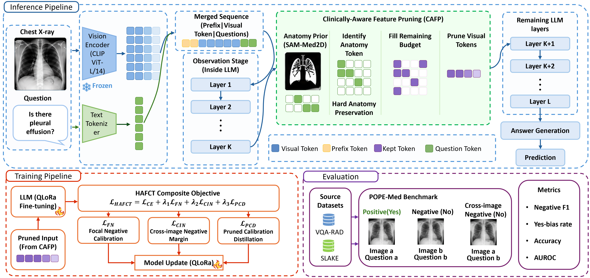

# MedPruneVLM — CAFP + HAFCT

### Anatomy-Aware Hallucination Reduction for Medical Large Vision Language Models

Official implementation of **MedPruneVLM**, built on **LLaVA-1.5-7B**:

- **CAFP (Clinically-Aware Feature Pruning)** — inference-time visual token pruning guided by visual information flow and anatomical priors.
- **HAFCT (Hallucination-Aware Focal Calibration Training)** — training designed to improve robustness to hard negatives, cross-image hallucination, and calibration changes after pruning.
- **POPE-Med** — a POPE-style medical hallucination benchmark with cross-image hard negatives.

> **Accepted at ACCV 2026 — 18th Asian Conference on Computer Vision.**

**Paper:** Coming soon.  

---

## Overview

<p align="center">
  
</p>

MedPruneVLM is designed to reduce unnecessary visual tokens while preserving clinically relevant visual information. During inference, CAFP identifies anatomy-relevant visual tokens and selectively prunes redundant tokens before the remaining language-model layers perform full decoding.

During training, HAFCT complements pruning with targeted calibration objectives for difficult negative examples and hallucination-prone cases.

The complete workflow includes:

**Medical image + question → visual encoding → CAFP → remaining LLM layers → answer**


## Main Components

### CAFP — Clinically-Aware Feature Pruning

CAFP performs inference-time visual token pruning using two complementary signals:

1. **Visual information flow** obtained from a lightweight observation stage.
2. **Anatomy prior** obtained from offline medical-image segmentation.

Anatomy-relevant tokens are protected during pruning, while the remaining token budget is selected using the combined importance signal.

### HAFCT — Hallucination-Aware Focal Calibration Training

HAFCT uses QLoRA-based fine-tuning with complementary objectives targeting:

- hard-negative examples,
- cross-image hallucination,
- calibration after visual-token pruning.


### POPE-Med

POPE-Med is a static POPE-style benchmark for evaluating medical visual hallucination.

It is constructed from **VQA-RAD** and **SLAKE** and includes cross-image hard negatives designed to test whether a model incorrectly transfers visual information from another image.

The benchmark files and construction metadata are included in this repository.

---

## Repository Structure

```text
.
├── assets/
│   └── framework.png
│
├── data/
│   ├── pope_med_eval.json
│   ├── cross_image_neg_pairs.json
│   ├── vqa_rad_{train,test}.json
│   ├── slake_{train,test}_en.json
│   ├── iu_xray_{train,test}.json
│   ├── training_data_with_cross_neg.json
│   └── anatomy_maps_cache/
│
├── scripts/
│   ├── download_datasets.py
│   ├── build_pope_med.py
│   ├── evaluate_baseline.py
│   ├── build_anatomy_maps.py
│   ├── cafp.py
│   ├── train_utils.py
│   └── train.py
│
├── pyproject.toml
├── LICENSE
└── README.md
```

Run commands from the **repository root**. Paths used by the scripts are root-relative.

---

## Installation

Python **3.10+** and a CUDA-capable NVIDIA GPU are recommended. The implementation uses 4-bit NF4 quantization. 


```bash
uv sync
```


---

## Data Setup

The repository contains the annotation JSON files required by the pipeline. The original medical images are **not redistributed** and must be obtained from their respective dataset providers.

| Dataset | Image location | Setup |
|---|---|---|
| VQA-RAD | `data/vqa_rad_images/{train,test}/` | Automatic download |
| SLAKE (English) | `data/images/slake/imgs/` | Manual download |
| IU X-Ray | `data/images/iu_xray/data/images/` | Manual download |

### VQA-RAD

```bash
python scripts/download_datasets.py
```

The script downloads the VQA-RAD images used by the repository.

### SLAKE

Download the English version of SLAKE from the official repository:

https://github.com/Med-AIUJ/SLAKE

Place the extracted images so that:

```text
data/images/slake/imgs/
```

contains the image files.

### IU X-Ray

Obtain the Indiana University chest X-ray dataset through its official OpenI distribution and organize it as:

```text
data/images/iu_xray/data/images/
data/images/iu_xray/data/indiana_dataset.csv
```

> Please follow the original dataset licenses and terms of use. This repository does not redistribute the original medical images.

---

## Quick Start

After installing the environment and preparing the datasets, run a small smoke test:

```bash
python scripts/evaluate_baseline.py --limit 50
```

For the complete training pipeline:

```bash
python scripts/evaluate_baseline.py
python scripts/train.py
```

---

## POPE-Med Benchmark

The released benchmark is **static** and should not be modified when reproducing the reported experiments.

The benchmark contains:

- standard positive examples,
- standard negative examples,
- cross-image hard negatives.

Cross-image negatives pair a question that is true for one image with a target image where the corresponding visual content is absent. This construction is intended to probe cross-image hallucination.

All cross-image pairings are recorded in:

```text
data/cross_image_neg_pairs.json
```

### Rebuild / verify

The benchmark and associated training data can be regenerated with:

```bash
python scripts/build_pope_med.py
```

The construction uses a fixed random seed to keep the generated files deterministic.

---

## Anatomy Maps

CAFP uses an anatomy prior generated offline with **SAM-Med2D**.

Precomputed anatomy maps are included in:

```text
data/anatomy_maps_cache/
```

For normal reproduction, no additional generation step is required.

### Regenerate anatomy maps

Clone SAM-Med2D:

```bash
git clone https://github.com/OpenGVLab/SAM-Med2D.git third_party/SAM-Med2D
```

Download the required SAM-Med2D checkpoint according to its official instructions and place it under the expected checkpoint directory.

Then run:

```bash
python scripts/build_anatomy_maps.py
```

For a single dataset:

```bash
python scripts/build_anatomy_maps.py --dataset vqa_rad
```

To perform a small dry run:

```bash
python scripts/build_anatomy_maps.py --dry-run
```

The anatomy maps are projected onto the visual-token grid used by CAFP.

---

## Training

### Step 0 — Baseline

Run:

```bash
python scripts/evaluate_baseline.py
```

This performs the baseline evaluation.


### Step 1 — Train MedPruneVLM

Run:

```bash
python scripts/train.py
```

Training checkpoints are automatically saved during training.

Typical output structure:

```text
checkpoints/
└── condition_D/
    ├── latest/
    ├── best/
    └── final/
```

Training logs are written to:

```text
logs/
├── training_D_loss.csv
└── training_D_validation.csv
```

The training script can resume from an existing `latest` checkpoint.

---

## Evaluation

The repository includes the core evaluation pipeline used for the main method.

The benchmark focuses on medical visual hallucination and includes:

- positive/negative yes-no questions,
- cross-image hard negatives,
- negative-answer F1,
- yes-bias,
- accuracy,
- AUROC.

The baseline evaluation can be run with:

```bash
python scripts/evaluate_baseline.py
```

---


## Citation

The official BibTeX entry will be added once the public publication metadata is available.

```text
Citation information coming soon.
```

---


## Disclaimer

This repository is provided for **research purposes**. MedPruneVLM is not a clinical diagnostic system and should not be used to make medical decisions or provide clinical advice.
